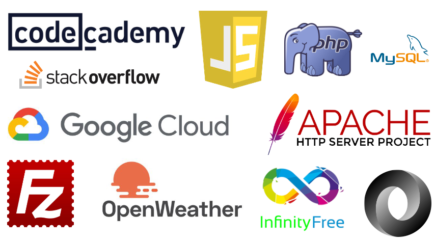

# http-5114
Files from HTTP5114 course.
## Workshops in Web Development 1
## Course Code: HTTP 5114

## Academic Year: 2025-2026

This course will allow students to access additional support for content delivered in the other classes each semester. Every student in the class will engage in a process of self-assessment to help them identify areas where they would benefit from help, and then the student and teaching team will set up a process for providing support for any areas where the student would benefit from some in-the-moment support. Mentors, tutors and workshops will be available.

# Links
https://product.hubspot.com/blog/git-and-github-tutorial-for-beginners


# Images



***Important Notice:*** This repository contains my weekly work for this course. Mastering Git is crucial for effective collaboration and version control in development projects.

## Example Code

Here’s a simple Git command example that shows how to clone a repository:

```bash
git clone https://github.com/your-username/your-repository.git
